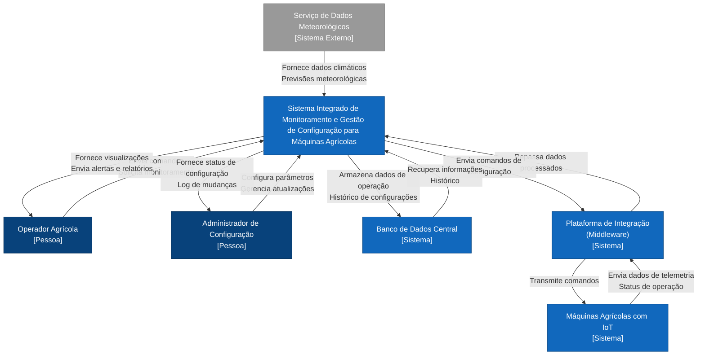

# Ponderada Engenharia de Software Módulo 10 - Diagrama C4 Model

## Sistema Integrado de Monitoramento e Gestão de Configuração para Máquinas Agrícolas

### Visão Geral
Este projeto apresenta a arquitetura de um Sistema Integrado para monitoramento em tempo real e gestão de configuração de máquinas agrícolas equipadas com sensores IoT e sistemas de automação.

### Objetivo
Desenvolver uma solução que permita:
- Monitorar em tempo real o desempenho e a saúde de cada máquina agrícola
- Gerenciar configurações remotas dos dispositivos e sistemas das máquinas
- Integrar dados externos, como informações meteorológicas, para auxiliar na manutenção preventiva e tomada de decisões

### Arquitetura
Este repositório contém o diagrama de contexto (Nível 1 do C4 Model) do sistema, definindo:
- Os atores e sistemas externos envolvidos
- As fronteiras e responsabilidades do sistema
- As interações entre o sistema e o mundo exterior

#### Componentes e Atores
- **Operador Agrícola**: Usuário que monitora e controla as máquinas através do sistema
- **Administrador de Configuração**: Responsável por gerenciar as configurações e garantir o funcionamento ideal
- **Máquinas Agrícolas com IoT**: Equipamentos que enviam dados de telemetria e recebem comandos
- **Serviço de Dados Meteorológicos**: Sistema externo que fornece informações climáticas
- **Banco de Dados Central**: Repositório que armazena todas as informações do sistema
- **Plataforma de Integração (Middleware)**: Componente que facilita a comunicação entre os dispositivos IoT e o sistema central

### Diagrama de Contexto (C4 Model - Nível 1)
O diagrama foi criado utilizando a notação Mermaid e pode ser visualizado no arquivo [diagrama.mmd](docs/diagrama.mmd), ou abaixo.

### Tecnologias
- Mermaid para documentação do diagrama como código
- C4 Model para modelagem da arquitetura
